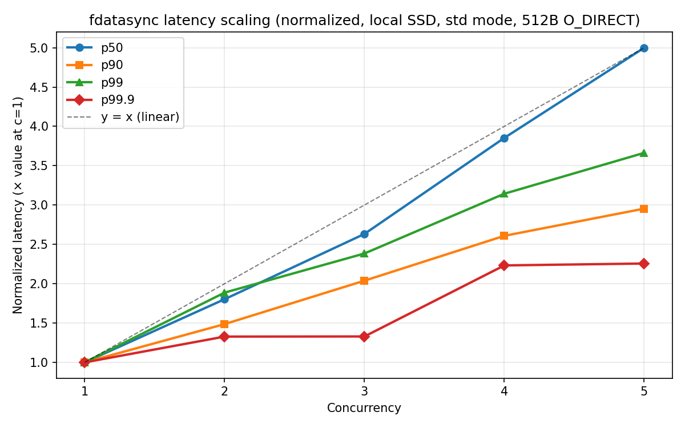

# fdatasync p50 latency scales linearly with concurrency on local SSD

## Setup

```bash
./target/release/wal-bench --dir ~/tmp/dir-a --cleanup -n 10000 -m std \
    --direct --sync-data --max-record-size 512 --min-record-size 512
```

- Mode: `std` (blocking write+fsync on tokio worker threads)
- Record size: fixed 512 bytes with `O_DIRECT`
- Sync: `fdatasync` after every write
- Concurrency: 1 through 5, with `--worker-cores` matching concurrency
- Storage: local NVMe SSD (Samsung SSD 9100 PRO 2TB)
- NVMe Queue [Queue Number (Core IDs)]: 0 (0,1,16), 1(2, 3, 18), 2(4, 20), 3(5, 21), 4(6, 22), ...


## Observation

p50 fdatasync latency grows nearly linearly with concurrency:

| Concurrency | p50 (μs) | p50 / c | Normalized (÷ c=1) |
|---|---|---|---|
| 1 | 852 | 852 | 1.00 |
| 2 | 1,536 | 768 | 1.80 |
| 3 | 2,243 | 748 | 2.63 |
| 4 | 3,283 | 821 | 3.85 |
| 5 | 4,259 | 852 | 5.00 |

Meanwhile `min` stays flat at ~520–530 μs across all concurrency levels, confirming the bare hardware flush cost is constant.



## Why std mode maximizes this effect

In `std` mode, `write()` + `fdatasync()` are blocking calls that hold the tokio worker thread for the full duration. With `--worker-cores` equal to concurrency, every worker is blocked on I/O at the same time, maximizing the probability that all `c` flushes overlap. There is no staggering or scheduling slack — the write loops run in lockstep.

## Tail latency note

p99.9 does **not** scale linearly — it jumps erratically (4,991 → 6,627 → 6,635 → 11,143 → 11,263 μs). This reflects bursty NVMe-internal events (garbage collection, wear leveling, write amplification) that compound under contention rather than smooth queueing.

