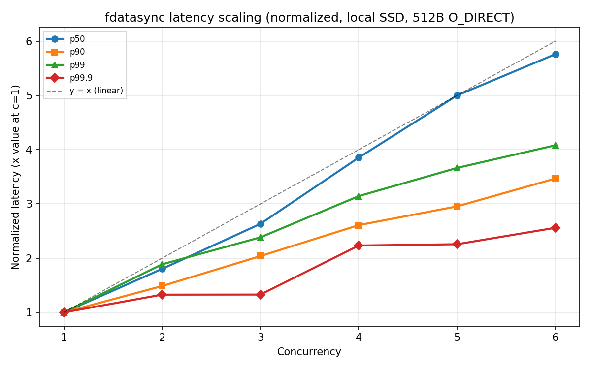
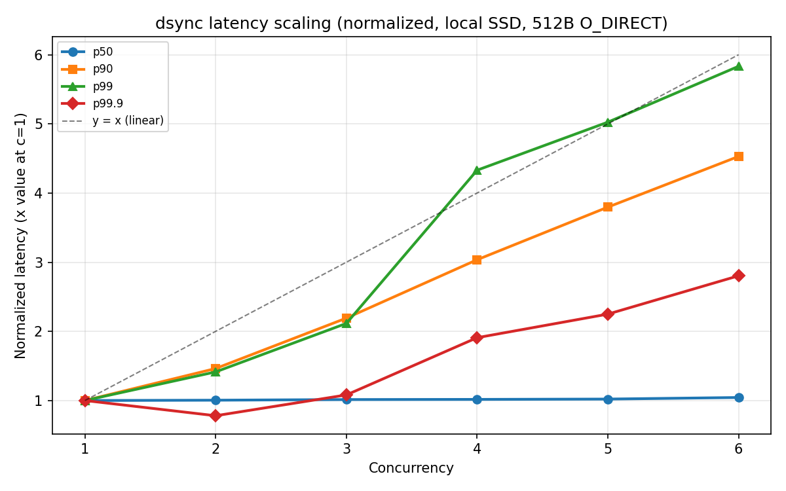
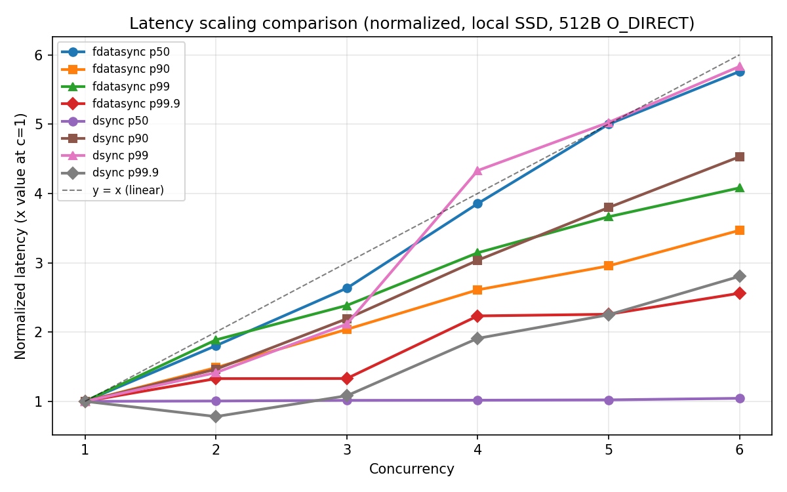

# fdatasync p50 latency scales linearly with concurrency on NVMe SSD

## Setup

```bash
./target/release/wal-bench --dir ~/tmp/dir-a --cleanup -n 10000 -m std \
    --direct --sync-mode fdatasync --max-record-size 512 --min-record-size 512
```

- Mode: `std` (blocking write+fsync on tokio worker threads)
- Record size: fixed 512 bytes with `O_DIRECT`
- Sync: `fdatasync` after every write
- Concurrency: 1 through 6, with `--worker-cores` matching concurrency
- Storage: local NVMe SSD (Samsung SSD 9100 PRO 2TB)
- NVMe Queue [Queue Number (Core IDs)]: 0 (0,1,16), 1(2, 3, 18), 2(4, 20), 3(5, 21), 4(6, 22), ...
- 6.18.16-200.fc43.x86_64 #1 SMP PREEMPT_DYNAMIC Wed Mar  4 19:13:32 UTC 2026 x86_64 GNU/Linux
- XFS File System

## Observation

p50 fdatasync latency grows nearly linearly with concurrency:

| Concurrency | p50 (μs) | p50 / c | Normalized (÷ c=1) |
|---|---|---|---|
| 1 | 852 | 852 | 1.00 |
| 2 | 1,536 | 768 | 1.80 |
| 3 | 2,243 | 748 | 2.63 |
| 4 | 3,283 | 821 | 3.85 |
| 5 | 4,259 | 852 | 5.00 |
| 6 | 4,907 | 818 | 5.76 |

Meanwhile `min` stays flat at ~520–530 μs across all concurrency levels, confirming the bare hardware flush cost is constant.



## O_DSYNC (FUA)

Opening files with `O_DSYNC` can make the kernel to set the FUA (Force Unit Access) bit on each write command.
No explicit fsync/fdatasync call is needed.

```bash
./target/release/wal-bench --dir ~/tmp/dir-a --cleanup -n 10000 -m std \
    --direct --sync-mode dsync --max-record-size 512 --min-record-size 512
```

With `--sync-mode dsync`, p50 stays flat as concurrency increases:

| Concurrency | p50 (μs) | Normalized (÷ c=1) |
|---|---|---|
| 1 | 1,716 | 1.00 |
| 2 | 1,724 | 1.00 |
| 3 | 1,740 | 1.01 |
| 4 | 1,744 | 1.02 |
| 5 | 1,752 | 1.02 |
| 6 | 1,791 | 1.04 |

p50 at c=1 is higher (~1,716 μs vs 852 μs) 



## Comparison




## PostgreSQL WAL Implementation Approach ([972c14f](https://github.com/postgres/postgres/tree/972c14fb9134fdfd76ea6ebcf98a55a945bbc988))

[5 sync methods:](https://github.com/postgres/postgres/blob/972c14fb9134fdfd76ea6ebcf98a55a945bbc988/src/backend/access/transam/xlog.c#L178)
* fsync
* fsync_writethrough 
* fdatasync: default option on Linux [ref](https://github.com/postgres/postgres/blob/972c14fb9134fdfd76ea6ebcf98a55a945bbc988/src/include/port/linux.h#L22)
* open_sync: bypass fsync syscall in [issue_xlog_fsync](https://github.com/postgres/postgres/blob/972c14fb9134fdfd76ea6ebcf98a55a945bbc988/src/backend/access/transam/xlog.c#L9374)
* open_datasync: bypass fsync syscall in [issue_xlog_fsync](https://github.com/postgres/postgres/blob/972c14fb9134fdfd76ea6ebcf98a55a945bbc988/src/backend/access/transam/xlog.c#L9374)

## man `open` `O_DSYNC`
> Write operations on the file will complete according to the requirements of synchronized I/O data integrity completion.
>
> By  the time write(2) (and similar) return, the output data has been transferred to the underlying hardware, along with any file metadata that would be required to retrieve that data (i.e., as though each write(2) was followed by a call to fdatasync(2)). 


## `FLUSH` is namespace global
* from NVM Express Base Specification: Revision 2.3

> The Flush command is used to request that the contents of volatile write cache be made non-volatile.
>
> If a volatile write cache is enabled (refer to section 5.2.26.1.4), then the Flush command shall commit data and metadata associated with the specified namespace(s) to non-volatile storage media.

## References

- [linux/block/blk-flush.c](https://github.com/torvalds/linux/blob/master/block/blk-flush.c) -- flush state machine serialization
- [Kernel docs: writeback cache control](https://docs.kernel.org/block/writeback_cache_control.html) -- REQ_PREFLUSH vs REQ_FUA